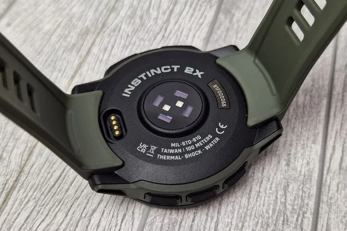
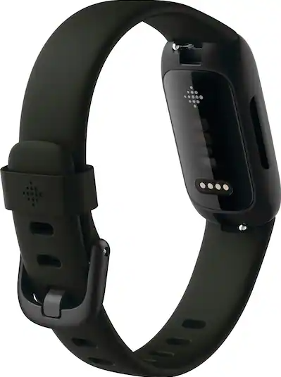

# Cadence Lock Investigator

An investigation into a specific failure mode of wrist-worn optical heart-rate
sensors: **cadence lock**, where the sensor's PPG signal appears to sync onto
a periodic mechanical vibration from running and report that frequency back
as heart rate, instead of the true cardiovascular pulse.

I started digging into this because I suspected cadence lock was quietly
inflating the weekly **Cardio Load** score Google Health reports (which is
derived from my Fitbit's HR data), to the point where it was getting hard to
read my actual week-to-week training-load trend. That's a suspicion that
motivated the investigation, not a confirmed finding — and it's why I
started logging a second, independent HR source (a Garmin, worn on the
other wrist during the same runs) to check the Fitbit readings against.

For a wrist-worn sensor, there are at least two distinct mechanical pathways
that could plausibly corrupt the PPG signal at a running cadence: the shockwave
from footstrike impact, transmitted through bone and soft tissue up to the
wrist, and the more local, continuous motion of arm swing itself perturbing
the sensor directly. Footstrike and arm swing both cycle at essentially the
same frequency as stride cadence in normal running gait — each roughly 1:1
with stride — so either pathway, or both at once, could plausibly produce a
spurious periodic component in the PPG spectrogram at or near the cadence
frequency. Stride cadence is what's actually recorded in the telemetry
(Garmin's running dynamics data), rather than footstrike shock or arm-swing
frequency directly, so this repo compares Garmin's and Fitbit's heart-rate
readings for the same run against Garmin's recorded stride cadence, looking
for periods where a device's "heart rate" tracks that cadence rather than a
plausible cardiac signal, while keeping in mind that stride cadence is a
proxy for — and mechanistically distinct from — the underlying footstrike
and arm-swing signals that could actually be driving the artifact. It's an
open investigation, not a finished study — neither the cadence-lock effect
nor the mechanisms behind it is asserted here as proven, for either
platform.

## Aims & Hypotheses

**Central hypothesis.** Under sustained running, a wrist-worn optical HR
sensor's PPG signal may synchronize onto a periodic mechanical input —
footstrike shock, arm-swing motion, or both, each roughly 1:1 with stride
cadence — and report that mechanical frequency back as heart rate instead
of the true cardiac pulse. That's the effect under investigation here, not
something asserted as proven for either device family (see the hedge
above).

**Motivating question.** HR-based training-load scores — Google Health's
Cardio Load and this project's own TRIMP-based comparison — are what
actually get used to plan and evaluate training week to week. If cadence
lock is real, does it meaningfully distort those scores, and under what
conditions?

**What this study does.** The same workout is recorded simultaneously on
two independent wrist-worn optical sensors (Garmin + Fitbit), alongside
Garmin's own stride-cadence telemetry for that run. From there, the
comparison looks at: (a) whether, and where, each device's HR trace tracks
stride cadence rather than a plausible cardiac pattern; (b) how far the two
devices diverge on a shared, published training-load formula — see
[Training-load comparison](#training-load-comparison-stagnos-modified-trimp)
below — rather than either platform's own undisclosed algorithm; and (c)
whether that divergence concentrates at particular paces or HR ranges, via
the pace-bucketed HR distribution included with each published run.

**What it doesn't (yet) do.** There is no automated cadence-lock detector —
the `flag` on each published run (see [Publishing a run](#publishing-a-run))
is a manual, per-run human judgment call naming which device, if any,
looked suspect. Nor does it attempt to establish that one device is "more
correct" in general; neither Garmin nor Fitbit is treated as a
ground-truth reference anywhere in this analysis.

**Open questions.** Whether the effect is real and repeatable, which
mechanical pathway — footstrike or arm swing — actually drives it if so,
and whether it's specific to particular sensor designs or wrist placements.

## Devices

The two devices under test are a **Garmin Instinct 2X Solar** and a **Fitbit
Inspire 3**, worn one per wrist during the same runs.





This section may grow if other devices get added to the comparison later.

## Architecture

The project has two deliberately separate halves:

1. **Local dev tool** (`main.py`) — a FastAPI app that does live OAuth
   against Google Health (for Fitbit HR data synced through it) and logs
   into Garmin Connect directly, fetches the latest run from both, aligns
   the two telemetry streams to a shared 1Hz timeline, and renders a live
   Plotly chart at `/visualize`. This is the day-to-day working tool, run
   only on the owner's machine, and it needs real credentials.

2. **Static published site** (`docs/`) — a plain HTML/JS site with no
   backend, served by GitHub Pages. It reads pre-computed JSON files from
   `docs/data/` (one file per published run, plus an `index.json`
   manifest) and renders the same kind of chart, a run gallery, and a
   pace-bucketed HR distribution table. It never talks to Garmin, Google,
   or any credentials — it only ever reads static JSON already committed to
   the repo.

The static site is updated only when the [publish pipeline](#publishing-a-run)
is run manually — nothing about it is live or auto-refreshing.

### Forking this for your own data

This is meant to be forkable, not a one-off tied to the original owner's
accounts: nothing in the pipeline is hardcoded to a specific Garmin or
Google identity. Fork the repo, drop your own Garmin and Google Health
credentials into `.env` (see [Local setup](#local-setup)), and the same
comparison runs on your own runs and devices. One thing to be aware of:
`docs/data/` in this repo currently holds the original owner's own
published runs as example data — if you're publishing your own, either
clear that directory first or expect your new runs to sit alongside the
existing examples until you replace them.

### Data integrity rule: gaps are signal, not noise

Raw HR and cadence data is **never smoothed, interpolated across sensor
gaps, or backfilled** in the published output. When a device stops
reporting for a stretch, that gap is treated as real information (probable
signal dropout) and rendered as a visible break in the chart rather than
papered over. Concretely: the Garmin/Fitbit merge in `build_run_payload`
(`main.py`) is an outer join with no fill, and every Plotly trace (in
`main.py`'s `/visualize` page as well as `docs/run.html`) is configured with
`connectgaps: false`. This is treated as a hard rule for this project's
credibility, not an incidental implementation detail.

### Training-load comparison: Stagno's Modified TRIMP

This section compares Garmin's and Fitbit's HR series using **Stagno's
Modified TRIMP** (Stagno, Thatcher & van Someren,
2007) — a published, citable formula, scored identically for both devices
against %HRmax zones (`analysis.py`'s `stagno_trimp()` and `TRIMP_ZONES`).
This replaced an earlier attempt to replicate Fitbit's Active Zone Minutes
(AZM): AZM is Fitbit's own undisclosed algorithm, and matching it required
picking free parameters (bin widths, HRmax) with no principled basis —
effectively curve-fitting rather than measuring. TRIMP has no such free
parameters, so both devices are held to the same fixed, external yardstick.

Garmin's native telemetry and Fitbit's Google-Health-synced data often have
different real sampling gaps (Fitbit's tends to be gappier and more
unevenly distributed). A naive comparison of two totals built from
different numbers of samples at different times would unfairly favor
whichever device happens to have denser data. To make the comparison fair,
`paired_trimp()` (`analysis.py`) first intersects both devices' valid-data
windows, so neither device's extra lead-in/tail time inflates its total for
free, then linearly interpolates both devices' real internal gaps onto the
exact same sample instants within that shared window — guaranteeing both
totals are computed from the same number of samples at the same times. This
interpolation is a deliberate, narrow, explicitly-authorized exception to
the no-fill rule above, scoped only to this one calculation: it is never
applied to the stored/displayed HR series used for charting, which still
shows real gaps as visual breaks.

The published result, `trimp_difference`, is a plain signed point
difference (garmin − fitbit), deliberately not a percentage — a percentage
would require picking one device as the reference denominator, and neither
device's TRIMP is a confirmed ground truth.

## Local setup

Requirements: **Python 3.12**.

```
pip install -r requirements.txt
```

Core dependencies: FastAPI + uvicorn (server), pandas + numpy (telemetry
alignment), httpx (Google/Garmin HTTP calls), python-dotenv (`.env`
loading), garminconnect (Garmin Connect API client).

Create a `.env` file in the repo root (already gitignored — never commit
it) with:

| Key | Purpose |
|---|---|
| `GOOGLE_CLIENT_ID` | OAuth client ID for the Google Health API app used to pull Fitbit HR data |
| `GOOGLE_CLIENT_SECRET` | OAuth client secret paired with the above |
| `REDIRECT_URI` | OAuth callback URL registered for the app (points at `/auth/google/callback`) |
| `GARMIN_EMAIL` | Garmin Connect account email (direct login, not OAuth) |
| `GARMIN_PASSWORD` | Garmin Connect account password |
| `HR_MAX` *(optional)* | Explicit HR max, used to compute Stagno's Modified TRIMP (see [Training-load comparison](#training-load-comparison-stagnos-modified-trimp)) |
| `BIRTH_YEAR` *(optional)* | Used to estimate HR max as `220 - age` if `HR_MAX` isn't set |

`HR_MAX`/`BIRTH_YEAR` are optional — if neither is set, TRIMP-based fields
(`total_trimp_garmin`, `total_trimp_fitbit`, `trimp_difference`) are simply
omitted from published runs rather than estimated.

There is no `.env.example` checked in yet; the table above is the source of
truth for what's needed.

After your **first** successful `/login/google` run, Google's refresh token
is persisted to a local SQLite file, `investigator.db` (also gitignored) —
not to `.env`. `print_refresh_token.py` reads it back out so you can copy it
into a GitHub Actions secret for the publish workflow (see below).

## Running locally

```
uvicorn main:app --reload
```

- `/` — a minimal home page with links to connect Google and to visualize
  the latest run.
- `/login/google` — starts the Google OAuth consent flow (Fitbit HR access
  via Google Health); redirects back to `/auth/google/callback`, which
  stores the access/refresh tokens in `investigator.db`.
- `/visualize` — fetches and aligns the latest Garmin + Fitbit run
  (`/fetch-all-data` under the hood) and renders it as an interactive
  Plotly chart (HR from both devices plus Garmin cadence), with a table
  view toggle.

A couple of other routes (`/test-garmin`, `/inspect-garmin-schema`,
`/fetch-latest-run`) exist as diagnostic endpoints used while reverse
engineering Garmin's activity-detail schema and Google Health's data
format — useful for debugging, not part of the main flow.

## Publishing a run

The public site is updated by manually triggering the **Publish run**
GitHub Actions workflow (`.github/workflows/publish.yml`), which takes one
input: `flag`, a choice of `positive_garmin` / `positive_fitbit` /
`positive_both` / `negative` / `unreviewed`.

The flag is a **manual human judgment call** — you look at the chart
yourself and decide whether it shows cadence lock, and if so, name which
device you suspect (or both). There is no automated detector yet; building
one is future work (see [Aims & Hypotheses](#aims--hypotheses)).

The workflow installs dependencies, runs `python publish_run.py --flag
<value>` (using `GOOGLE_CLIENT_ID`, `GOOGLE_CLIENT_SECRET`,
`GOOGLE_REFRESH_TOKEN`, `GARMIN_EMAIL`, `GARMIN_PASSWORD`, and optionally
`HR_MAX`/`BIRTH_YEAR` from repo secrets), then commits and pushes whatever
lands in `docs/`.

`publish_run.py` re-fetches the latest Garmin + Fitbit run (bypassing the
local Garmin response cache), computes derived stats (Stagno's Modified
TRIMP per device when an HR max is available, and pace-bucketed HR
distributions), writes the full run payload to `docs/data/<activity_id>.json`, and
adds/updates a summary entry for it in `docs/data/index.json`, the manifest
the gallery page reads. `docs/index.html` lists published runs with their
flag badge; `docs/run.html` renders the full chart and tables for one run.

The same run can be published again later (e.g. to correct a `flag`) — it
overwrites its existing entry in the manifest rather than duplicating it.

## Status

This is an active, evolving personal investigation, not a finished product.
The ingestion, publishing, and visualization pipeline works end to end;
correlation analysis and an actual cadence-lock detection heuristic are not
implemented yet — see [Aims & Hypotheses](#aims--hypotheses) for what this
project is and isn't currently trying to answer.
